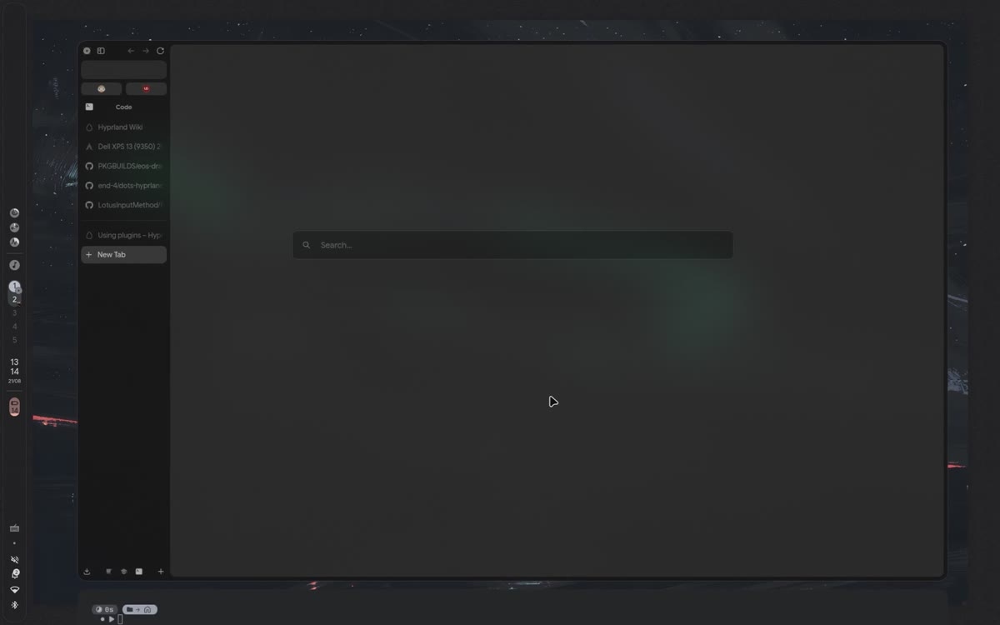

# CONFIGURATIONS AND SCRIPTS FOR END4 DOTFILES

This repository contains my Hyprland configurations for End-4 dotfiles.
It includes personalized layout tweaks, keybindings, and various utility scripts.

## Video showcase

[Watch the video showcase](https://github.com/VietNguyenVN/End4_plus/raw/refs/heads/main/assets/showcase.mp4) (16 seconds).

## Features

These configurations extend the original setup with:

- Custom window rules and layouts
- Personalized keybindings
- (Some) scripts for automation
- Extended .config directory (e.g. nvim)

[NOTE]

This is an EXTREMELY PERSONAL configuration, so expect opinionated choices.

Feel free to adapt anything to your own workflow.

This setup is based on the End-4 Hyprland dotfiles: <https://github.com/end-4/dots-hyprland>
